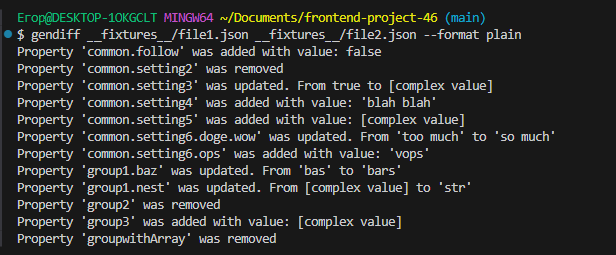
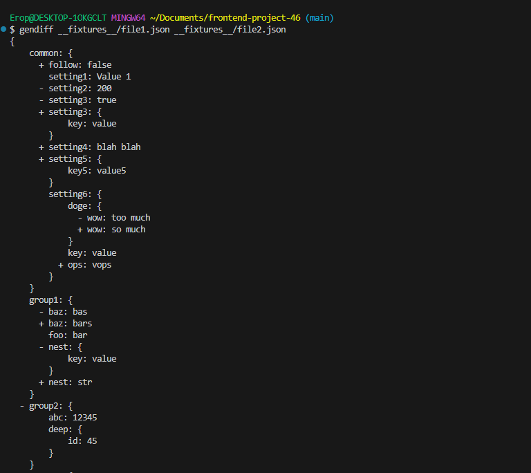
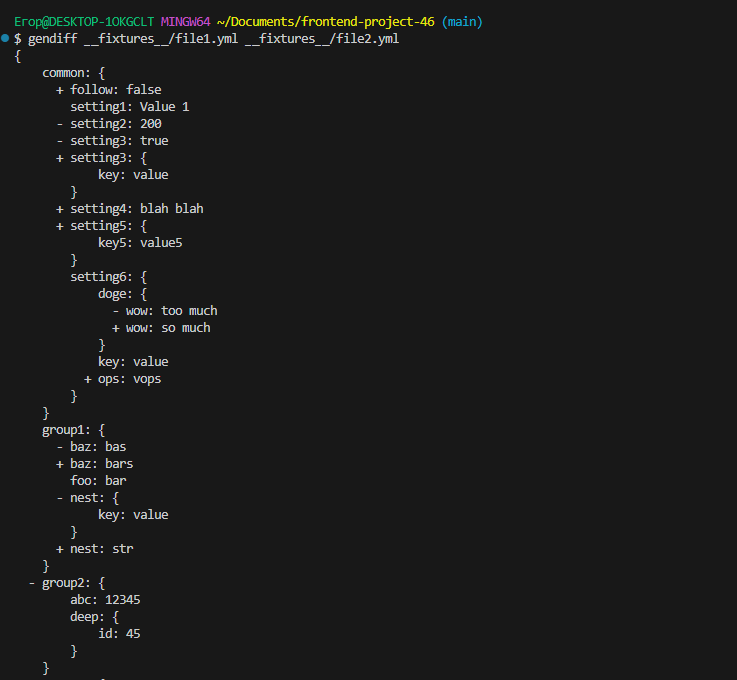
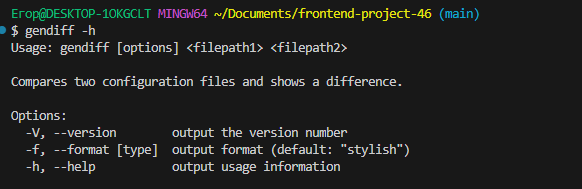

Вычислитель отличий
### Hexlet tests and linter status:
[](https://github.com/zitraxblade/frontend-project-46/actions)
```bash
gendiff __fixtures__/file1.json __fixtures__/file2.json --format json
Проект "Вычислитель отличий"
Установка зависимостей: make install
Пример работы с json файлами с вложенными структурами, вывод в формате "plain"

Сравнение плоских файлов (JSON):

Рекурсивное сравнение файлов (YML):

Вывод справки программы:

